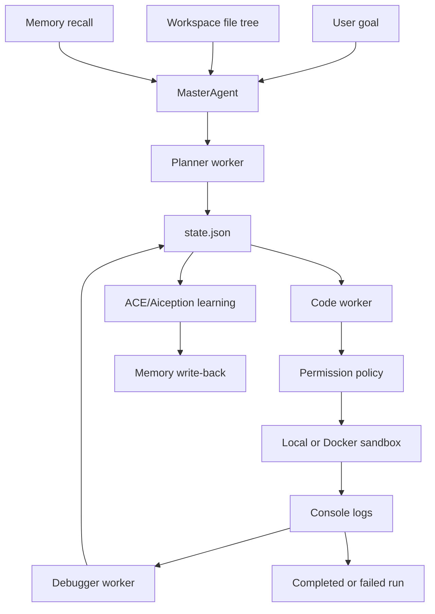

# Master Agent Orchestrator

> Coordinate a reasoning planner, a code worker, a debugger, durable state, and an execution sandbox from one local Python harness.

## What It Does

This recipe adds a small orchestration framework for the Claude plus Codex/GPT collaboration pattern. The orchestrator owns workspace context, state, memory, permissions, retries, learning, and execution. The model workers only produce structured plans, code artifacts, or debug feedback.

The default path uses mock workers so you can verify the harness without API keys or external calls. Runtime execution defaults to Docker so generated code does not run directly on the host. Live Claude and Codex/GPT providers can be attached later through JSON command bridges.



## Architecture

The harness shape is a lean workflow orchestrator for code tasks.

| Boundary | Responsibility |
| -------- | -------------- |
| `MasterAgent` | Controls lifecycle, retries, checkpoints, and terminal status |
| `Planner` | Turns the global goal into structured tasks |
| `Coder` | Generates one executable artifact for one task |
| `Debugger` | Converts execution failure into focused feedback |
| `WorkspaceContext` | Captures the current file tree into shared state before planning |
| `CapabilityRegistry` | Loads the named Claude and Codex tool surface into shared state |
| `JsonStateStore` | Persists goal, task status, history, and console logs |
| `JsonlMemoryStore` | Recalls and writes compact local memories with source and tags |
| `OpenBrainAgentMemoryProvider` | Optional adapter for the OB1 Agent Memory API |
| `AiceptionLearner` | Runs an ACE learning pass after failures or completed runs |
| `PermissionPolicy` | Allows only approved commands by default |
| `SandboxRunner` | Writes generated files into a run directory and executes them locally or through Docker |

## Shared State

The orchestrator stores one source of truth in `state.json`:

| Field | Purpose |
| ----- | ------- |
| `goal` | The global objective |
| `workspace.file_tree` | Current workspace file tree snapshot, capped by `--max-files` |
| `capabilities` | Named Claude and Codex tool-call surface from the capability registry |
| `recalled_memory` | Local or OpenBrain memory records recalled before planning |
| `tasks` | Claude-style structured roadmap |
| `console_logs` | Sandbox stdout, stderr, exit code, command, and duration |
| `learning_candidates` | ACE/Aiception findings proposed after execution |
| `history` | Checkpoint events and timestamps |

## Memory And ACE Learning

The default memory store is local JSONL at:

```text
<run-root>/memory.jsonl
```

Before planning, the orchestrator recalls matching records and saves them into `state.json` as `recalled_memory`. After the run, the ACE learning loop reviews execution evidence:

| Step | Meaning |
| ---- | ------- |
| Assess | Look for non-obvious failures, retries, completed workflow evidence, and reusable patterns |
| Codify | Convert the finding into a small learning candidate with trigger, lesson, and evidence |
| Embed | Write reusable candidates back to local memory with `aiception` and `ace-learning` tags |

This mirrors the Aiception quality gate: only reusable, specific, verified learning should graduate into memory or a skill. The built-in learner is intentionally conservative.

Use the OB1 Agent Memory API instead of local JSONL when you want shared memory across runtimes:

```bash
python3 master_agent.py "Build and verify a feature" \
  --openbrain-memory-endpoint "https://YOUR_PROJECT_REF.supabase.co/functions/v1/agent-memory-api" \
  --openbrain-memory-key "$MCP_ACCESS_KEY" \
  --openbrain-workspace-id "your-workspace" \
  --openbrain-project-id "master-agent-orchestrator"
```

The adapter uses the runtime-neutral `openbrain.agent_memory.recall.v1` and `openbrain.agent_memory.writeback.v1` contracts. Generated lessons require review by default.

## Prerequisites

- Python 3.10+
- Docker, required for the default execution path
- Live provider CLIs or wrapper scripts, optional

No Open Brain database credentials are required for the default mock run.

## Tool Contracts

Provider wrappers must return JSON that matches the schema files in [contracts](./contracts/):

| Contract | File |
| -------- | ---- |
| Planner response | [planner-response.schema.json](./contracts/planner-response.schema.json) |
| Coder response | [coder-response.schema.json](./contracts/coder-response.schema.json) |
| Debugger response | [debugger-response.schema.json](./contracts/debugger-response.schema.json) |
| Capability registry | [capability-registry.json](./contracts/capability-registry.json) |

The Python bridge validates required top-level fields before using a provider response. Keep the wrappers small: provider API keys belong in wrapper environment variables, not command arguments or state files.

## Credential Tracker

Copy this block into a text editor only if you attach live providers.

```text
MASTER AGENT ORCHESTRATOR -- CREDENTIAL TRACKER
--------------------------------------

OPTIONAL LIVE PROVIDERS
  Claude wrapper command:    ____________
  Codex/GPT wrapper command: ____________
  Debugger wrapper command:  ____________

SANDBOX
  Docker image:              ____________
  Run directory:             ____________

--------------------------------------
```

## Quick Start

From this recipe folder:

```bash
python3 master_agent.py --doctor
```

`--doctor` prints sandbox, workspace, memory, contract, and provider-wrapper readiness as JSON. It exits nonzero when Docker is required but unavailable, when the configured Docker image is not present locally, or when a configured provider wrapper command cannot be found.

```bash
python3 master_agent.py "Build a tiny feature and verify it" --run-root runs/demo
```

Expected output:

```json
{
  "status": "completed",
  "state_path": "runs/demo/state.json"
}
```

Inspect the durable state:

```bash
python3 -m json.tool runs/demo/state.json
```

Use `--workspace-root` to point the shared file-tree snapshot at another repo or subfolder:

```bash
python3 master_agent.py "Plan against OB1" --workspace-root ../../ --run-root runs/ob1-plan
```

## Docker Sandbox

Docker is the default because generated code should run outside the host Python process:

```bash
python3 master_agent.py "Run a sandboxed task" --sandbox docker --run-root runs/docker-demo
```

The Docker mode runs with `--network none` and mounts only the task run directory into `/workspace`.
It also uses `--pull=never` so a missing image fails loudly instead of spending a task attempt on an implicit image pull. Pull the image before running:

```bash
docker pull python:3.12-slim
```

If you use a local image that has its own entrypoint, clear it:

```bash
python3 master_agent.py "Run a sandboxed task" \
  --docker-image "YOUR_LOCAL_IMAGE_ID_OR_TAG" \
  --docker-entrypoint ""
```

Use `--sandbox local` only for trusted development tests of the harness itself, not for untrusted model-generated code.

## Live Provider Bridge

Live providers are intentionally outside the core harness. Add small wrapper commands that read JSON from `stdin` and write JSON to `stdout`.

Planner wrapper output:

```json
{
  "tasks": [
    {
      "id": "create-files",
      "description": "Create the initial file layout",
      "status": "planned",
      "attempts": 0,
      "feedback": []
    }
  ]
}
```

Coder wrapper output:

```json
{
  "file_name": "task.py",
  "content": "print('hello from generated code')\n",
  "command": ["/usr/bin/python3", "task.py"]
}
```

Debugger wrapper output:

```json
{
  "feedback": "The generated code imported a missing package. Retry with standard-library code."
}
```

Run with wrapper commands:

```bash
python3 master_agent.py "Implement the requested change" \
  --planner-command "./workers/claude-plan" \
  --coder-command "./workers/codex-code" \
  --debugger-command "./workers/claude-debug" \
  --sandbox docker \
  --run-root runs/live-provider-test
```

Keep provider API keys in the wrapper environment. Do not write keys to command arguments, generated code, state files, or logs.

## Permission Model

The default policy allows only:

```text
python executable + task.py
```

This is deliberately narrow. Add commands only after you define:

- why the command is needed
- whether it reads, writes, or mutates external systems
- what approval is required
- what audit evidence should be written

## Expected Outcome

A successful run produces:

- `state.json` with the goal, task list, status, history, feedback, and console logs
- `workspace.file_tree` inside state so both model roles see the same workspace snapshot
- `capabilities` inside state with Claude tools `create_task_list`, `delegate_to_codex`, `approve_and_proceed`, `debug_error` and Codex tools `write_file`, `patch_code`, `run_terminal_command`
- `memory.jsonl` with compact ACE/Aiception learning records
- one subdirectory per task under `sandbox/`
- generated task files inside those subdirectories
- `learning_candidates` in state for review
- terminal status of `completed` or `failed`

## Tests

Run:

```bash
python3 -m unittest discover -s tests
```

The tests verify:

- mock end-to-end execution completes and persists state
- failed generated code receives debugger feedback and retries
- unapproved shell commands are denied
- state storage round-trips JSON
- local memory recalls matching records and writes learning candidates
- workspace file tree is captured in shared state
- named Claude and Codex tool-call capabilities are loaded into shared state
- provider contract validation fails loudly on malformed JSON
- the OpenBrain Agent Memory adapter maps recall and write-back payloads correctly
- Docker readiness is visible through `--doctor`
- Docker command construction disables networking and mounts only the task directory

## Troubleshooting

**Issue: Docker sandbox fails with command not found**

Install Docker Desktop, or use the default local sandbox until Docker is available.

**Issue: Live wrapper returns invalid JSON**

Run the wrapper directly and pipe a sample payload into it. The orchestrator expects one JSON object on stdout and a zero exit code.

**Issue: Generated code needs another command**

Add the command to `PermissionPolicy` only after documenting the side effects and approval requirement. Keep the active command pool as small as possible.
